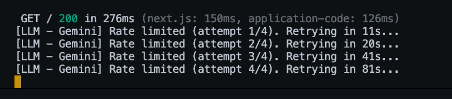
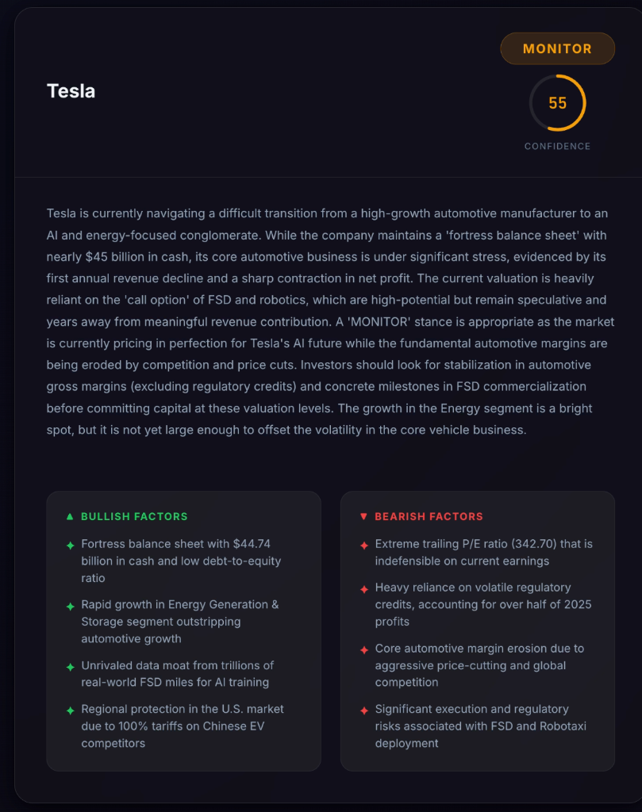
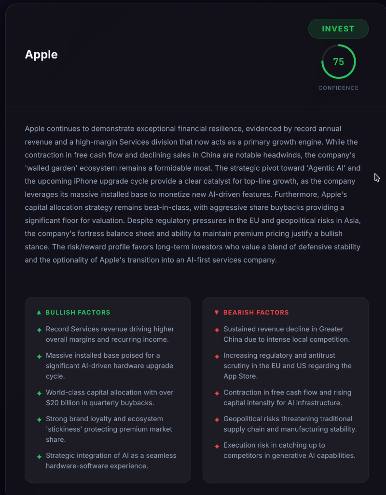
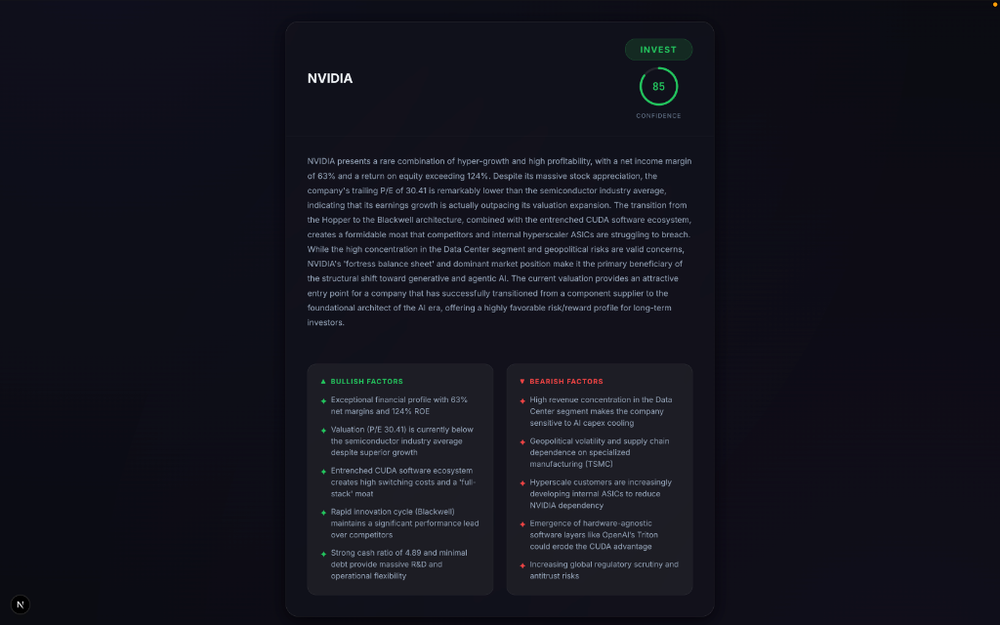
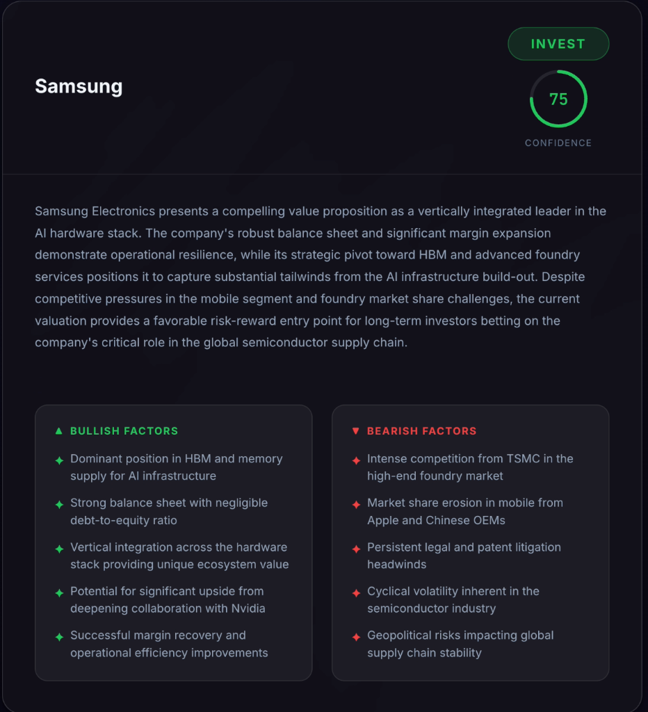

# InvestAgent — AI-Powered Investment Research Agent

> **Live Demo:** [investment-agent-one.vercel.app](https://investment-agent-one.vercel.app/)

An autonomous multi-agent system that researches any public company in real time and delivers a structured **INVEST / PASS / MONITOR** verdict with confidence scoring, bullish/bearish factor analysis, and full reasoning — powered by a LangGraph agent pipeline, Tavily web search, and Google Gemini LLMs.

---

## Overview

InvestAgent takes a company name (e.g. "Tesla") and orchestrates a multi-step research pipeline:

1. **Resolves** the company → ticker, full legal name, sector.
2. **Researches in parallel** — financials, news, competitors, and industry trends — using live web search (Tavily) and LLM analysis.
3. **Synthesizes** all research into a unified analysis.
4. **Makes a final investment decision** — INVEST, PASS, or MONITOR — with a 0-100 confidence score, full reasoning, and 5 bullish/bearish factors.

The entire pipeline streams results to the frontend in real time via Server-Sent Events (SSE), so you can watch each step complete as it happens.

---

## How to Run It

### Prerequisites

- **Node.js** ≥ 18
- A **Google Gemini API Key** — [Get one here](https://aistudio.google.com/apikey)
- A **Tavily Search API Key** — [Get one here](https://tavily.com/)

### Setup

```bash
# 1. Clone the repo
git clone <repo-url>
cd investment_agent

# 2. Install dependencies
npm install

# 3. Create your environment file
cp .env.local.example .env.local
```

Add your API keys to `.env.local`:

```env
# Google Gemini API Key
GOOGLE_API_KEY=your_google_api_key_here

# Tavily Search API Key
TAVILY_API_KEY=your_tavily_api_key_here
```

### Run

```bash
# Development
npm run dev

# Production build
npm run build && npm start
```

Open [http://localhost:3000](http://localhost:3000), type a company name, and click **Analyze**.

---

## How It Works

### Architecture

The core of the system is a **LangGraph StateGraph** — a directed acyclic graph where each node is a specialist agent that reads from and writes to a shared state object.

```
                    ┌─────────────────────┐
                    │   resolveCompany    │  (LLM: name → ticker, sector)
                    └────────┬────────────┘
                             │
           ┌─────────┬──────┴──────┬─────────────┐
           ▼         ▼             ▼              ▼
   ┌──────────┐ ┌─────────┐ ┌───────────┐ ┌───────────┐
   │financials│ │  news    │ │competitors│ │ industry  │   ← 4 parallel nodes
   │ (search  │ │ (search  │ │ (search + │ │ (search + │     (Tavily + LLM)
   │  + LLM)  │ │  + LLM)  │ │   LLM)    │ │   LLM)    │
   └────┬─────┘ └────┬─────┘ └─────┬─────┘ └─────┬─────┘
        │             │             │              │
        └─────────┬───┴─────────────┴──────────────┘
                  ▼
        ┌─────────────────┐
        │   analyzeAll    │  (LLM: synthesize all research)
        └────────┬────────┘
                 ▼
        ┌─────────────────┐
        │  makeDecision   │  (LLM: INVEST / PASS / MONITOR)
        └─────────────────┘
```

### Tech Stack

| Layer       | Technology                                             |
|-------------|-------------------------------------------------------|
| Framework   | Next.js 16 (App Router)                                |
| Agent Graph | LangGraph.js (`@langchain/langgraph`)                  |
| LLM         | Google Gemini (multi-model cascade)                    |
| Web Search  | Tavily Search API (`@langchain/tavily`)                |
| Streaming   | Server-Sent Events (SSE) via `ReadableStream`          |
| Frontend    | React 19, vanilla CSS (premium dark theme)             |
| Deployment  | Vercel (serverless functions)                          |

### Data Flow

1. **Frontend** → `POST /api/research` with `{ company }`.
2. **API Route** → Runs `investmentGraph.streamEvents()` and pushes SSE events (`node_complete`, `result`, `error`, `done`).
3. **Frontend** → Parses the SSE stream, updates a live timeline, and renders the final Decision Card.

### Shared State

All nodes read/write to a single `AgentState` object using LangGraph's `Annotation` system:

- **Input:** `company`
- **Resolved:** `ticker`, `fullName`, `sector`
- **Research:** `financialData`, `newsData`, `competitorData`, `industryData`
- **Analysis:** `analysis` (synthesized markdown)
- **Decision:** `decision`, `confidence`, `reasoning`, `bullishFactors`, `bearishFactors`

Channels like `completedSteps` use array-append reducers so parallel nodes can write to the same channel without conflicts.

---

## Key Decisions & Trade-offs

### 1. Multi-Model Cascade Instead of Exponential Backoff

**Problem:** Gemini's free tier has strict rate limits (5 requests/min, 20 requests/day per model). Our pipeline makes 7 LLM calls per analysis (1 resolve + 4 parallel research + 1 synthesis + 1 decision), so hitting rate limits was inevitable.

**What I tried first:** Exponential backoff with retry (10s → 20s → 40s → 80s). This worked in theory, but in practice the wait times compounded to 3-5 minutes of dead time, and daily quotas meant retries would just keep failing.



**What I did instead:** A **model cascade** — the LLM wrapper pre-initializes 4 different Gemini models and tries them in sequence. If one hits a rate limit, it instantly switches to the next model with zero wait time:

```
gemini-3.1-flash-lite → gemini-3-flash-preview → gemini-3.5-flash → gemini-3.1-pro-preview
```

This is faster and more resilient: each model has its own independent rate-limit quota, so even when one is exhausted the next one can serve requests immediately.

### 2. Parallel Research Nodes

The four research steps (financials, news, competitors, industry) are **independent of each other** — they only depend on the resolved company info. LangGraph lets us fan out from `resolveCompany` to all four, and they execute in parallel. This cuts the total research time by ~4x compared to sequential execution.

**Trade-off:** Parallel nodes writing to the same state channel (`currentStep`) caused `INVALID_CONCURRENT_GRAPH_UPDATE` errors. I fixed this by adding a custom reducer that accepts the last value.

### 3. SSE Streaming Over WebSockets

For real-time updates I chose Server-Sent Events over WebSockets because:
- One-way data flow (server → client) is all we need
- Native browser support with `EventSource` / `fetch` streaming
- Works on Vercel's serverless infrastructure (no persistent connections needed)
- Simpler to implement and debug

### 4. Tavily Over Custom Scraping

Tavily provides clean, structured search results optimized for LLMs. Building a custom web scraper would add complexity (rate limiting, parsing, anti-bot protections) without meaningfully improving quality for this use case.

### 5. What I Left Out

- **Historical price data / charts** — Would need a financial data API (e.g. Alpha Vantage, Yahoo Finance) which was out of scope.
- **User portfolio tracking** — Requires authentication, database, and recurring analysis.
- **Multi-company comparison** — The agent analyzes one company at a time; batch mode would be a natural extension.
- **Source citations** — The research nodes consume Tavily results but don't surface individual source URLs in the final output.

---

## Example Runs

### Tesla — MONITOR (55% confidence)

> *"Tesla is currently navigating a difficult transition from a high-growth automotive manufacturer to an AI and energy-focused conglomerate..."*



| Bullish | Bearish |
|---------|---------|
| Fortress balance sheet with $44.74B cash | Extreme trailing P/E (342.70) |
| Rapid Energy segment growth | Heavy reliance on regulatory credits |
| Unrivaled FSD data moat | Core automotive margin erosion |
| U.S. tariff protection from Chinese EVs | FSD and Robotaxi execution risk |

---

### Apple — INVEST (75% confidence)

> *"Apple continues to demonstrate exceptional financial resilience, evidenced by record annual revenue and a high-margin Services division..."*



| Bullish | Bearish |
|---------|---------|
| Record Services revenue and margins | Revenue decline in Greater China |
| Massive installed base for AI upgrade cycle | Regulatory scrutiny (EU/US App Store) |
| $20B+ quarterly buybacks | Free cash flow contraction |
| Strong brand loyalty and ecosystem | Geopolitical supply chain risks |
| Strategic AI integration | Playing catch-up in generative AI |

---

### NVIDIA — INVEST (85% confidence)

> *"NVIDIA presents a rare combination of hyper-growth and high profitability, with a net income margin of 63%..."*



| Bullish | Bearish |
|---------|---------|
| 63% net margins, 124% ROE | High Data Center revenue concentration |
| P/E (30.41) below semiconductor average | Geopolitical and TSMC dependency |
| Entrenched CUDA software moat | Customers building internal ASICs |
| Blackwell architecture performance lead | OpenAI Triton eroding CUDA advantage |
| Strong cash ratio with minimal debt | Increasing regulatory scrutiny |

---

### Samsung — INVEST (75% confidence)

> *"Samsung Electronics presents a compelling value proposition as a vertically integrated leader in the AI hardware stack..."*



| Bullish | Bearish |
|---------|---------|
| Dominant HBM position for AI infra | TSMC competition in high-end foundry |
| Strong balance sheet, negligible D/E | Mobile market share erosion |
| Vertical integration across hardware | Legal and patent litigation headwinds |
| Deepening Nvidia collaboration upside | Cyclical semiconductor volatility |
| Margin recovery and efficiency gains | Geopolitical supply chain risks |

---

## What I Would Improve With More Time

1. **Source Citations & Transparency** — Surface the individual URLs and snippets from Tavily so users can verify claims and drill into primary sources.

2. **Financial Data APIs** — Integrate Alpha Vantage or Yahoo Finance for real financial metrics (P/E, revenue, margins, price history) instead of relying on web search for numbers.

3. **Interactive Charts** — Add stock price charts, revenue trend visualizations, and competitive comparison spider diagrams.

4. **Caching Layer** — Cache research results (e.g. Redis or in-memory) with TTL so repeated queries for the same company don't re-run the full pipeline.

5. **Multi-Company Comparison** — Let users analyze and compare multiple companies side-by-side in a single session.

6. **Streaming Token-by-Token** — Currently the UI waits for each graph node to fully complete. Streaming the LLM output token-by-token within each node would make the experience feel more responsive.

7. **Agent Memory & Context** — Let the agent remember past analyses so it can say "compared to when we analyzed this company last week, the outlook has improved because..."

8. **Better Error Recovery** — If one research node fails (e.g. Tavily timeout), the pipeline should degrade gracefully and still produce a partial analysis rather than failing entirely.

---

## Project Structure

```
investment_agent/
├── src/
│   ├── app/
│   │   ├── api/research/route.ts   # SSE streaming API endpoint
│   │   ├── components/
│   │   │   ├── CompanySearch.tsx    # Search input + Analyze button
│   │   │   ├── DecisionCard.tsx     # Final verdict card
│   │   │   ├── FactorsGrid.tsx      # Bullish/Bearish factors grid
│   │   │   └── ResearchTimeline.tsx  # Live pipeline progress
│   │   ├── page.tsx                 # Main page (orchestrates UI)
│   │   ├── layout.tsx               # Root layout + metadata
│   │   └── globals.css              # Premium dark theme styles
│   └── lib/
│       ├── llm.ts                   # Multi-model cascade wrapper
│       ├── tools/search.ts          # Tavily search tool wrapper
│       └── graph/
│           ├── state.ts             # AgentState annotation schema
│           ├── graph.ts             # LangGraph StateGraph assembly
│           └── nodes/
│               ├── resolveCompany.ts     # Company → ticker + sector
│               ├── researchFinancials.ts # Financial data research
│               ├── researchNews.ts       # Latest news research
│               ├── researchCompetitors.ts# Competitor analysis
│               ├── researchIndustry.ts   # Industry trends research
│               ├── analyzeAll.ts         # Synthesize all research
│               └── makeDecision.ts       # Final investment decision
├── docs/screenshots/                # Example run screenshots
├── .env.local                       # API keys (not committed)
├── package.json
└── README.md
```

---

Built with LangGraph, Google Gemini, Tavily, and Next.js.
